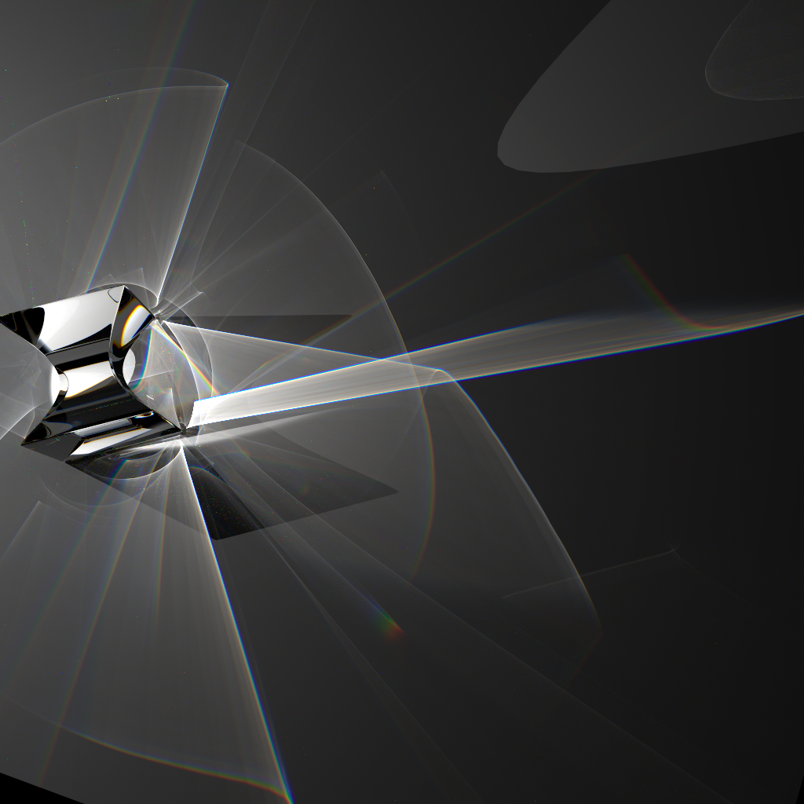

<h1 align="center">AkariRender</h1>
<h5 align="center">High Performance CPU/GPU Physically Based Renderer</h5>

<!--  -->


AkariRender is a CPU/GPU physically based renderer written in Rust and Vulkan RTX.
Previous version with PPG and SMCMC is in [legacy-cpp](https://github.com/shiinamiyuki/akari_render/tree/legacy-cpp) branch.


## Features
- Spectral Rendering
- Out of Core Rendering
- Unidirectional Path Tracing
- Wavefront Path Tracing
- SPPM
- BDPT
- [Neural Radiance Cache](https://arxiv.org/pdf/2106.12372.pdf)
- Quad-BVH
- Ray Packet Traversal

## Build Requirements
If you are using < Windows 10, please upgrade to Windows 10 or above.
- CMake >3.12
- clang++ in PATH

## Build & Run
```
cargo build --relase
cargo run --release --bin akr-cli -- -s ./scenes/cbox/cbox.json -r ./scenes/cbox/integrator.json

# On Mac:
cargo run --release --bin akr-cli -- -s ./scenes/cbox/cbox.json -r ./scenes/cbox/integrator.json --as qbvh

# GPU Rendering is broken now
# cargo run --release --features gpu --bin akr-cli -- -s ./scenes/cbox.json -r ./scenes/integrator.json --gpu
```
