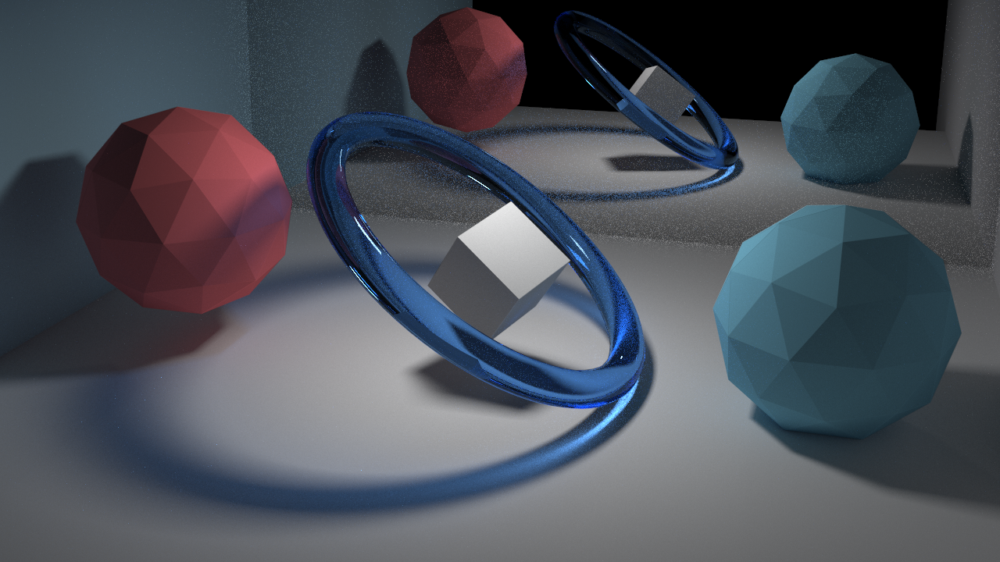

<h1 align="center">AkariRender</h1>
<h5 align="center">Extensible Physically Based Renderer (and More!)</h5>

AkariRender is a modular physically based renderer written in C++17.
### Status

## Features
 - Modular Design: Every functionality is implemented using plugins
 - Advanced Light Transport:
    -  Unidirectional path tracing
    - Path guiding
    - Bidirectional path tracing
    - Multiplexed metropolis light transport
 - Optional Embree backend
 - Optional Intel OpenImageDenoise

## Road Map:
 - Vertex Connection and Merging

