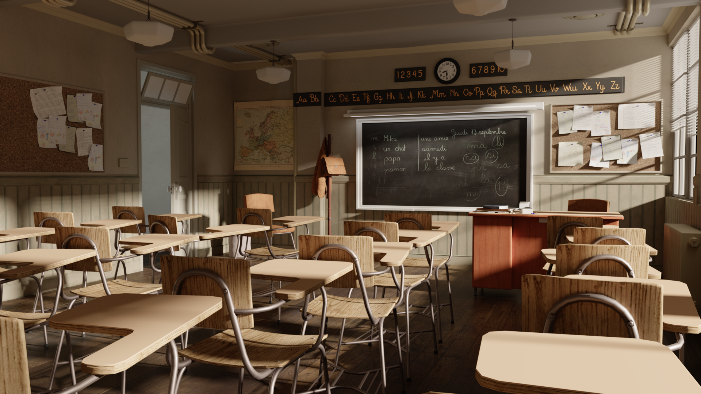

<h1 align="center">AkariRender v3 (Experimental)</h1>
<h5 align="center">High Performance CPU/GPU Physically Based Renderer</h5>


Scene by Christophe Seux (CC0)

AkariRender is a CPU/GPU physically based renderer written in Rust and powered by *LuisaCompute*.

## Build and Run
### Dependencies
To build the project, you need to have the following dependencies installed:
- [CMake 3.29+](https://cmake.org/)
- [Ninja](https://ninja-build.org/)
- [Clang 18+](https://github.com/llvm/llvm-project/releases)
- [Rust](https://www.rust-lang.org/)
- [Python 3.12+](https://www.python.org/)
- [LuisaCompute Python DSL 2](https://github.com/LuisaGroup/luisa-python-lang)
- [Vulkan SDK](https://vulkan.lunarg.com/sdk/home) (Optional, for GPU rendering)
<!-- - [CUDA 12.2](https://developer.nvidia.com/cuda) (Optional, for GPU rendering) -->

The project makes extensive use of runtime code generation, which requires `clang++` to be avilable in the system path during runtime.

### Build
First clone the repository and its submodules:
```bash
git clone --recursive github.com/shiinamiyuki/akari_render
```
Run the following command to build the project as a python module:
```bash
python build.py [profile]
```

### Run
Load a scene and render it!
```python
import pyakari as akr
import numpy as np
import cv2
scene_graph = akr.load('scenes/cbox.json')
scene = scene_graph.build()
pt = akr.PathTracer(spp=16)
def progressive_render_callback(image: akr.Image):
    img = np.frombuffer(image.data_ptr(), dtype=np.float32, count=image.width * image.height * 4).reshape((image.height, image.width, 4))
    cv2.imshow('image', img)
    cv2.waitKey(1)
pt.render(scene, progressive_render_callback)
```